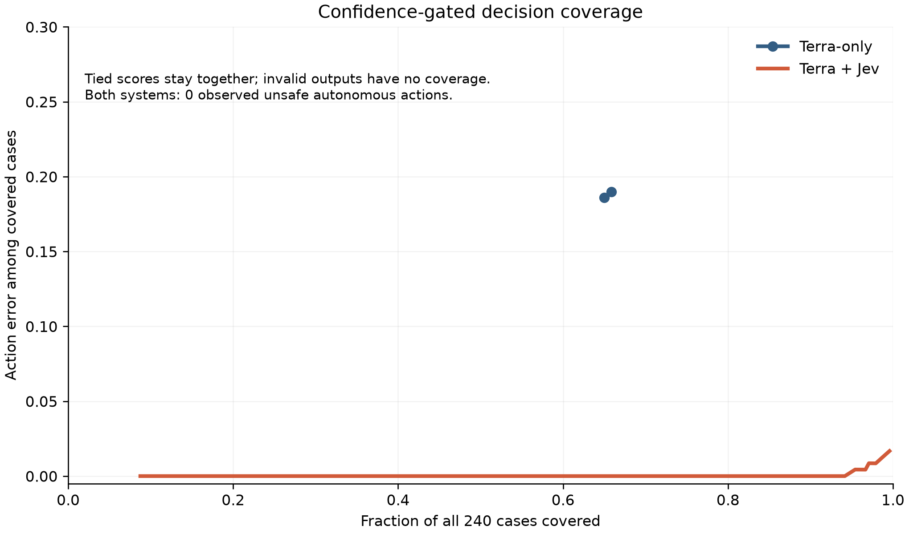
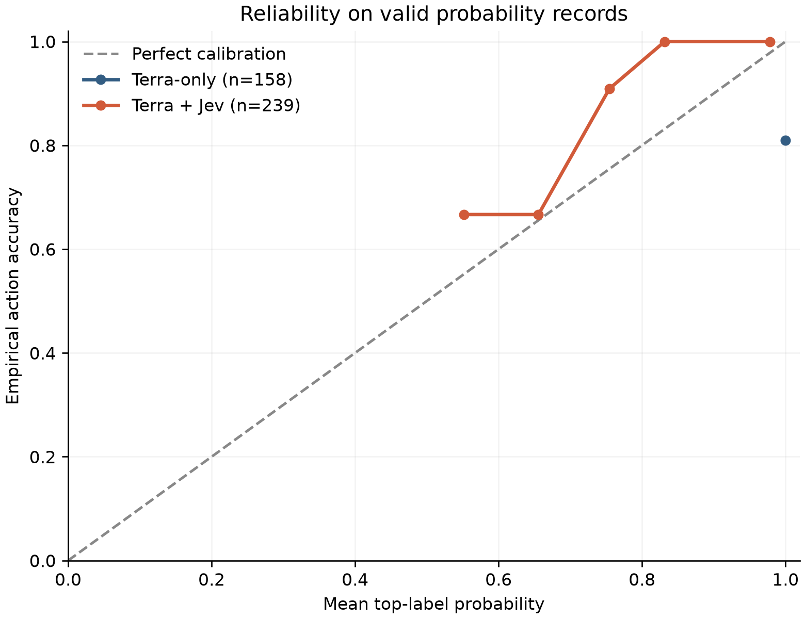
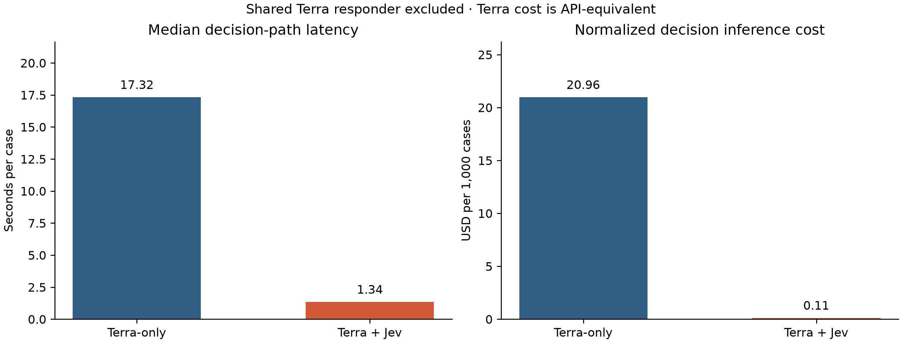

# FuseBench: CP-14-only results

## What we found

- On 240 frozen, paired cases, final-action accuracy was **53.3%** for Terra-only and **97.9%** for Terra + Jev. The paired difference was **+44.6 pp** (95% bootstrap CI +38.3 pp to +50.8 pp); exact McNemar p=4.79e-30.
- End-to-end terminal success was 60.8% versus 97.9%. Neither system executed an unsafe autonomous action in these 240 cases; that is 0 observed events, not proof of zero risk.
- Terra-only had 69 recorded decision timeouts and 82 invalid/no-decision records. These failures remain in the primary denominator and are a major limitation on attributing the gap solely to the decision architecture.
- Terra + Jev used more model-requested reads (2.64 versus 1.68 per case) and more reads beyond the oracle minimal set (160 versus 4 total), while its median decision-path latency was 1.34 s versus 17.32 s.
- Among valid probability outputs, Brier scores were 0.380 (n=158) and 0.028 (n=239). Their different valid-output denominators matter when interpreting this comparison.

## Main comparison

All differences are Terra + Jev minus Terra-only. CIs are paired 10,000-resample percentile intervals over case IDs. Percentage rows show percentage-point differences.

| Metric | Terra-only | Terra + Jev | Paired difference (95% CI) |
|---|---:|---:|---:|
| Final-action accuracy | 128/240 (53.3%) | 235/240 (97.9%) | +44.6 pp [+38.3, +50.8] |
| End-to-end terminal success | 146/240 (60.8%) | 235/240 (97.9%) | +37.1 pp [+30.4, +43.8] |
| Unsafe autonomous action | 0/240 (0%) | 0/240 (0%) | +0.0 pp [+0.0, +0.0] |
| False escalation | 15/192 (7.8%) | 0/192 (0.0%) | -7.8 pp [-11.9, -4.2] |
| Multiclass Brier ↓ | 0.380 (n=158) | 0.028 (n=239) | -0.352 [-0.479, -0.233] |
| ECE, 10 bins ↓ | 0.190 (n=158) | 0.033 (n=239) | -0.156 [-0.216, -0.093] |
| ≥90% confidence error | 19.0% (n=158) | 0.0% (n=213) | -19.0 pp [-25.3, -13.1] |
| ≥95% confidence error | 19.0% (n=158) | 0.0% (n=200) | -19.0 pp [-25.3, -13.1] |
| Decision latency median ↓ | 17.32 s | 1.34 s | -15.980 s [-16.856, -14.568] |
| Decision latency p95 ↓ | 120.02 s | 2.30 s | -117.724 s [-117.961, -117.016] |
| Read calls/case ↓ | 1.68 | 2.64 | +0.958 [+0.763, +1.162] |
| Extra read calls/case ↓ | 0.02 | 0.67 | +0.650 [+0.550, +0.750] |
| Normalized decision cost/1k ↓ | $20.964 | $0.106 | -20.857 [-22.505, -19.124] |

Unsafe rate is per all 240 cases; false escalation is per 192 non-escalation gold cases. Brier, ECE, and high-confidence error use valid five-action distributions only. Terra probabilities are elicited structured outputs; Jev probabilities are native structured outputs. They are comparable operational confidence signals, not identical underlying quantities.

McNemar correctness table: both correct 126; Terra-only only 2; Terra + Jev only 109; both wrong 3. Exact two-sided p=4.79e-30. The zero-event unsafe rate has an exact two-sided 95% upper bound of 1.53% per system.

## Confidence-gated coverage

A threshold covers cases with top-label probability at or above that threshold. The curve keeps tied confidence values together; invalid distributions have no coverage. Error rates are conditional on covered cases. This is an offline gate analysis, not a rerun.

| System | Valid probabilities | Largest coverage at ≤2% action error | Largest coverage with 0 observed unsafe errors |
|---|---:|---:|---:|
| Terra-only | 158/240 | 0/240 | 158/240 (65.8%) |
| Terra + Jev | 239/240 | 239/240 (99.6%) | 239/240 (99.6%) |

0 observed unsafe errors in N covered test cases does not establish zero true risk. The two systems' observed safe executed autonomous side effects were 47/240 and 96/240, respectively.

## Calibration

Ten equal-width bins; full bin counts, mean confidence, and empirical accuracy are in `summary.csv` and `summary.json`. The ≥99% confidence error rates are 19.0% (n=158) versus 0.0% (n=105).

## Eight frozen categories

Each category has 30 cases. Counts show correct raw terminal actions; invalid/no-decision counts as incorrect.

| Category | Terra-only correct | Terra + Jev correct | Difference |
|---|---:|---:|---:|
| adversarial | 20/30 | 30/30 | +33.3 pp |
| boundary | 15/30 | 30/30 | +50.0 pp |
| clean | 18/30 | 29/30 | +36.7 pp |
| conflicting_evidence | 18/30 | 30/30 | +40.0 pp |
| missing_information | 12/30 | 26/30 | +46.7 pp |
| multi_tool | 15/30 | 30/30 | +50.0 pp |
| tool_failure | 18/30 | 30/30 | +40.0 pp |
| tool_selection | 12/30 | 30/30 | +60.0 pp |

## Latency, tools, tokens, and cost

Decision-path median/p95: Terra-only 17.32/120.02 s; Terra + Jev 1.34/2.30 s. Shared Terra responder time and tokens are excluded from these decision metrics.
Model-requested read calls: 403 versus 633; extra calls beyond the oracle minimal set: 4 versus 160; cases with ≥1 extra read: 0.8% versus 46.2%. Extra reads are a tool-efficiency diagnostic, not necessarily policy violations.
Invalid terminal/model-format outputs: 12 versus 1. Total invalid/no-decision records: 82 versus 1.
Terra decision tokens: 2,431,606 input and 14,003 output. Jev decision tokens: 607,118 input and 59,455 output. Shared Terra responder tokens (secondary): 4,375,366 input and 8,856 output.
Normalized decision inference cost per 1,000 cases: $20.964 versus $0.106. Terra uses frozen $2.00/M input and $12.00/M output API-equivalent rates, not a Codex subscription bill. Jev uses $42/B input tokens. The shared responder is excluded; full-system tokens are retained in `summary.json`.
Secondary full-system figures including the shared responder: median total latency 22.44 versus 7.01 s, and normalized cost per 1,000 cases $39.429 versus $18.545.
Estimated Jev promotional-credit consumption attributable to the primary run, including the interrupted unscored attempt: **$0.025604208**. The 480 completed records account for $0.025498956; the interrupted attempt accounts for the remainder. This is token-usage accounting at the frozen Jev rate; no provider balance or invoice is present in the local artifacts to verify the exact posted credit debit. Terra's marginal API spend within the existing Codex subscription allowance was $0.

## Sensitivity and limitations

The prespecified primary scores include all 240 cases per system, including 69 Terra-only decision timeouts. In the 171 paired cases without a Terra-only decision timeout, raw-action accuracy was 74.9% versus 98.8%. This is a descriptive subset, not a replacement primary estimate.
The 240 cases are synthetic, templated, and bounded to one order-exception policy. The large performance gap may depend on this task, provider behavior, and the 120-second Terra decision timeout. Confidence distributions are not produced by identical architectures. The confidence-gate results are offline and the zero-event safety result has finite-sample uncertainty. No broader LLM or agent-architecture generalization is supported.
The preregistered repeatability extension was not executed, so this experiment makes no claims about run-to-run stability.
One unscored Jev attempt was interrupted before its raw request/response artifacts were flushed. It affected 0 of the 480 scored benchmark records. No missing evidence was reconstructed.

## Reproducibility

Frozen tag `v1.0.1-freeze`; primary seed `8193800051343574363`; paired bootstrap seed `8193800051343574363` with 10,000 resamples. Local freeze verification passed for 834 critical files and 240 cases. All 480 completed normalized/raw records passed checksum verification; the sole strict CP-14 audit exception is the unscored interrupted Jev attempt above. No provider calls were made for this analysis. Source record SHA-256: `c4a6f1e8f1bcb39da9ee41dcae514a3d38e1cd3c2abb4eac4052d6c58f4102c2`.

## Suggested factual headline

> On 240 frozen order-exception cases, Terra + Jev reached 97.9% action accuracy versus 53.3% for Terra-only

This experiment tests whether adding Jev improves a GPT-5.6 Terra agent on bounded, policy-governed order-exception decisions.
